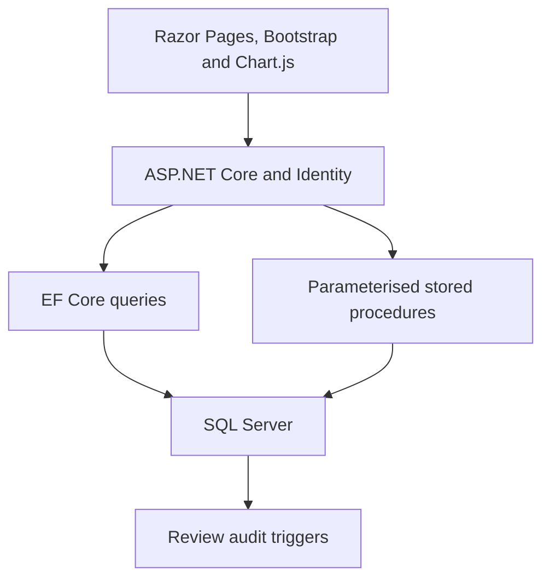

# Employee Performance Management System

[](https://dotnet.microsoft.com/en-us/download/dotnet/7.0)
[](https://learn.microsoft.com/aspnet/core/razor-pages/)
[](https://www.microsoft.com/sql-server)

**Employee Performance Management System** is a role-aware HR and management portal built with **ASP.NET Core Razor Pages**. It brings employee records, performance reviews, and team reporting into one SQL Server-backed application, with database-level auditing for review changes.

The project demonstrates full-stack .NET development, ASP.NET Core Identity, Entity Framework Core, parameterised stored-procedure access, relational database design, T-SQL triggers, and interactive Chart.js reporting.

## Project Demo

[](https://deanprogramming.github.io/CV/images/EmployeeManagementSystemMP4.mp4)

**[Watch the recorded project walkthrough](https://deanprogramming.github.io/CV/images/EmployeeManagementSystemMP4.mp4)**

The walkthrough demonstrates the application's employee, manager, and HR-facing workflows.

**[Read the design document](https://deanprogramming.github.io/CV/Dean%20H%20-%20Employee%20Performance%20Management%20System%20Design%20Document.pdf)**

## Overview

The application gives each role a focused workflow:

- **Employees** can sign in and review their own performance history.
- **Managers** can search for employees, create or update reviews, compare team results, identify overdue reviews, and inspect the highest average scores.
- **HR users** receive the manager tools plus employee creation and employee-record maintenance.

Performance data is presented both as searchable tables and interactive charts. Individual line charts show change over time and the employee's average score, while team bar charts compare employee scores and highlight results below the application's `70`-point threshold.

## Features

### Authentication and role-aware navigation

- Sign-in and sign-out with ASP.NET Core Identity
- Application roles for `Employee`, `Manager`, and `HR`
- Role-dependent routing after login
- Manager and HR page restrictions through Razor Pages authorisation attributes
- Seeded fictional accounts for local demonstration

### Employee record management

- Search by first name, last name, or position
- HR form for capturing a new employee's details, department, login name, and role selection
- HR workflow for updating employee details and department membership
- Separate `Employee` and `Department` SQL schemas
- Foreign-key relationships between employees, reviews, and departments

### Performance review workflow

- Employees can view their own dated review history
- Managers and HR users can find an employee and inspect previous reviews
- Create reviews containing a date, numeric score, and written comments
- Update an existing performance review
- Display reviews in reverse chronological order
- Record inserted and updated reviews in an audit table through T-SQL triggers

### Management reporting

- Compare employee review scores across all teams
- Filter performance reporting to HR, Team A, Team B, or Support
- Return the five employees with the highest average scores
- Find employees whose latest review is older than a configurable number of months
- Highlight team scores below `70`
- Show team averages and individual historical averages on interactive charts

### Database-focused implementation

- Entity Framework Core for mapped entities and LINQ queries
- Parameterised ADO.NET commands for stored-procedure execution
- T-SQL procedures for employee creation, employee updates, review changes, and management reports
- Cascading foreign keys for related employee data
- Insert and update triggers for performance-review auditing
- SQL permission-role script for HR, manager, and employee access levels

## Core Workflows

### 1. Sign in and enter the correct workspace

ASP.NET Core Identity authenticates the user. The application reads their assigned roles and routes managers and HR users to the management dashboard, while employees are taken directly to their personal review history.

### 2. Review team performance

A manager can switch between company-wide and department-specific views. The application queries employee, department, and review data through EF Core, then serialises the result for a Chart.js bar chart with average and low-score reference lines.

### 3. Manage performance reviews

Managers and HR users can search for an employee, inspect their review history, and create or update a review. Changes are sent to parameterised SQL Server stored procedures and captured by database audit triggers.

### 4. Maintain employee records

HR users can add employees or update existing personnel and department information through dedicated Razor Pages workflows.

## System Architecture



The application is organised into four main areas:

1. **Presentation layer**
   - Razor Pages and PageModel handlers
   - Bootstrap-based forms, tables, cards, and responsive layout
   - Focused JavaScript modules for team and employee charts

2. **Identity and access layer**
   - ASP.NET Core Identity users and roles
   - Role-aware navigation and page authorisation
   - Employee, manager, and HR workflows

3. **Application and data-access layer**
   - EF Core queries for employee and review data
   - Scoped stored-procedure services
   - Parameterised SQL commands for database operations

4. **Database layer**
   - SQL Server schemas, tables, foreign keys, and sample data
   - Stored procedures for commands and reports
   - Audit triggers for review changes

## Technology Stack

| Area | Technology |
| --- | --- |
| Web application | .NET 7, ASP.NET Core Razor Pages |
| Authentication | ASP.NET Core Identity with application roles |
| Data access | Entity Framework Core and parameterised ADO.NET commands |
| Database | Microsoft SQL Server and T-SQL |
| Front end | Razor, HTML, CSS, JavaScript, and Bootstrap |
| Data visualisation | Chart.js and chartjs-plugin-annotation |
| JSON serialisation | Newtonsoft.Json |

## Data Model Highlights

| Table or entity | Responsibility |
| --- | --- |
| `Employee.EmployeeInfo` | Employee identity, position, role label, and hire date |
| `Employee.PerformanceReview` | Dated performance score and manager comments |
| `Department.DepartmentInfo` | Department reference data |
| `Department.EmployeeDepartment` | Employee-to-department association |
| `Employee.PerformanceReviewAudit` | Insert and update history for performance reviews |
| ASP.NET Identity tables | Login accounts, application roles, and role membership |

Foreign keys connect reviews and department assignments to employees. Deleting an employee cascades to their related review and department-assignment records in the supplied SQL schema.

## Stored Procedures and Database Automation

| SQL asset | Purpose |
| --- | --- |
| `AddNewEmployee` | Coordinates the employee, department, and database-role steps used by the HR creation flow |
| `UpdateEmployeeDetails` | Updates an employee and their department assignment |
| `InsertPerformanceReview` | Creates a new performance review |
| `UpdatePerformanceReview` | Updates the selected review |
| `GetEmployeePerformanceReview` | Returns review history for one employee |
| `GetEmployeeDueForReview` | Finds employees outside a configurable review window |
| `GetTop5EmployeesAverageScore` | Ranks employees by average review score |
| `Trigger_AfterInsert_PerformanceReview` | Audits newly inserted reviews |
| `Trigger_AfterUpdate_PerformanceReview` | Audits review updates |

## Access Control and Data Integrity

- ASP.NET Core Identity supplies application authentication and role membership.
- Manager and HR dashboard pages use role-based authorisation.
- HR-only pages protect employee creation and maintenance workflows.
- Stored-procedure values are supplied as SQL parameters.
- SQL foreign keys maintain employee, review, and department relationships.
- Database triggers retain an audit record when a review is inserted or updated.
- The supplied demo users and review records are fictional portfolio data.

## Running the Project Locally

### Prerequisites

- [.NET 7 SDK](https://dotnet.microsoft.com/en-us/download/dotnet/7.0)
- SQL Server, SQL Server Express, or SQL Server LocalDB
- SQL Server Management Studio or another SQL client

### 1. Clone and restore

```bash
git clone https://github.com/DeanProgramming/Employee-Performance-Management-System.git
cd Employee-Performance-Management-System
dotnet restore
```

### 2. Configure the connection string

The committed connection string targets the original development machine and should be overridden locally. One option is .NET user secrets:

```bash
dotnet user-secrets init --project EmployeePerformanceApp/EmployeePerformanceApp.csproj
dotnet user-secrets set "ConnectionStrings:DefaultConnection" "Server=(localdb)\MSSQLLocalDB;Database=EmployeePerformanceDB;Trusted_Connection=True;TrustServerCertificate=True" --project EmployeePerformanceApp/EmployeePerformanceApp.csproj
```

Use an appropriate SQL Server connection string if LocalDB is unavailable. Do not commit real credentials.

### 3. Prepare the database

Create an `EmployeePerformanceDB` development database and provision the ASP.NET Core Identity schema before loading the sample users. The `SQL` directory contains:

- application table definitions
- fictional employee and review seed data
- reporting and command stored procedures
- review-audit triggers
- optional database-role permissions

The scripts are order-dependent and are not designed to be rerun against a populated database. A future migration-based bootstrap is listed below as a project improvement.

### 4. Build and run

```bash
dotnet build EmployeePerformanceApp.sln
dotnet run --project EmployeePerformanceApp/EmployeePerformanceApp.csproj
```

Open the HTTPS address printed in the terminal.

## Sample Accounts

After the fictional sample data has been loaded, these accounts demonstrate each application role:

| Role | Username | Password |
| --- | --- | --- |
| Manager | `john.doe` | `YourSecurePassword123!` |
| Employee | `jane.smith` | `YourSecurePassword123!` |
| HR | `liam.walker` | `YourSecurePassword123!` |

These credentials are for local portfolio demonstration only and must not be reused in a deployed environment.

## Configuration

| Setting | Purpose | Required |
| --- | --- | --- |
| `ConnectionStrings:DefaultConnection` | SQL Server connection used by EF Core and stored-procedure services | Yes |
| `Logging:LogLevel` | Application and framework logging thresholds | No |

## Project Structure

| Path | Contents |
| --- | --- |
| `EmployeePerformanceApp/Pages` | Razor Pages, PageModels, authentication, and role-specific workflows |
| `EmployeePerformanceApp/Models` | EF Core employee, review, and department-assignment entities |
| `EmployeePerformanceApp/Data` | Identity-aware EF Core database context |
| `EmployeePerformanceApp/StoredProcedures` | C# services that execute SQL Server procedures |
| `EmployeePerformanceApp/wwwroot/js` | Individual and team Chart.js visualisations |
| `EmployeePerformanceApp/wwwroot/css` | Application styling and responsive dashboard rules |
| `SQL` | Schema, seed data, stored procedures, triggers, and database roles |

## Current Limitations and Next Steps

This repository is a portfolio and learning project rather than a production HR platform. The most valuable next steps are:

- add checked-in EF Core migrations and an idempotent database bootstrap
- add automated unit, integration, authorisation, and database tests
- add a GitHub Actions restore, build, and test workflow
- apply a global authenticated-user policy and audit authorisation across every page handler
- strengthen server-side validation for review scores, dates, text lengths, and nullable report data
- replace static demo credentials with a controlled, read-only demonstration mode before public hosting

## Author

Built by **Dean Holland** as a personal software-development portfolio project.

GitHub: [DeanProgramming](https://github.com/DeanProgramming)
